<div align="center">


<h1>Azure Virtual Desktop (AVD) for Developers</h1>

<p><strong>Enterprise Cloud Workstations & Intelligent Engineering Infrastructure</strong></p>

[](https://devopstrio.co.uk/)
[](https://devopstrio.co.uk/)
[](https://devopstrio.co.uk/)
[](/apps/security-engine)

</div>

---

## 🏛️ Executive Summary

**AVD for Developers** is a flagship enterprise platform designed to revolutionize the way engineering teams work. In the modern era of remote and hybrid work, providing developers with high-performance, secure, and standardized workstations is a competitive necessity.

This platform automates the delivery of **Cloud Development Workstations**, providing engineers with ephemeral, pre-configured environments that include everything from VS Code and IntelliJ to Docker, Kubernetes, and specialized AI/ML toolchains. By decoupling the development environment from physical hardware, organizations can protect source code, accelerate onboarding from weeks to minutes, and enable high-performance compute (including GPU acceleration) for build-heavy or AI-centric workloads.

### Strategic Business Outcomes
- **Accelerated Onboarding**: Provision a production-ready, security-hardened developer environment in under 10 minutes for new hires and contractors.
- **Enhanced Source Code Protection**: Maintain all intellectual property within the secure Azure boundary with zero-trust data loss prevention (DLP) controls.
- **Optimized Engineering Performance**: Move build-heavy workloads to high-spec Azure NV-series or D-series VMs, reducing local wait times and improving developer joy.
- **Global Collaboration & Accessibility**: Enable seamless remote engineering for global teams with low-latency access to regional cloud workstations.

---

## 🏗️ Technical Architecture Details

### 1. High-Level Developer Workspace Architecture
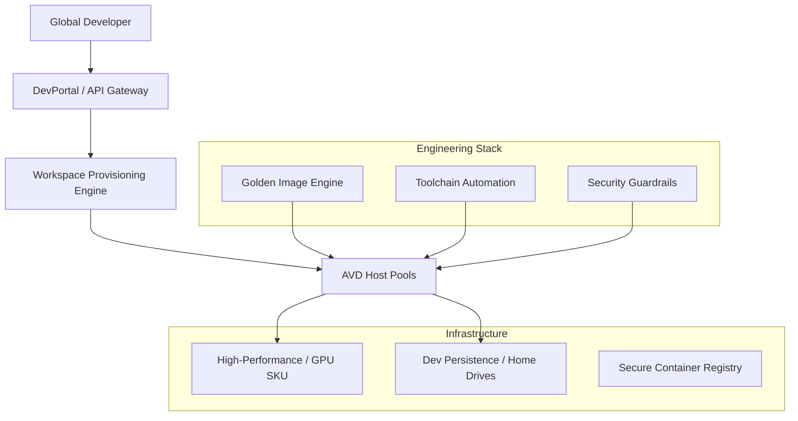

### 2. Workspace Provisioning Workflow
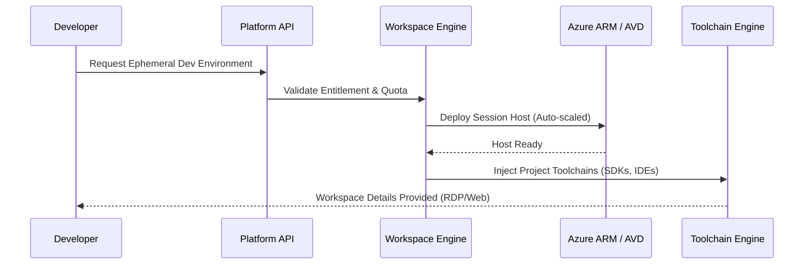

### 3. Ephemeral Environment Lifecycle
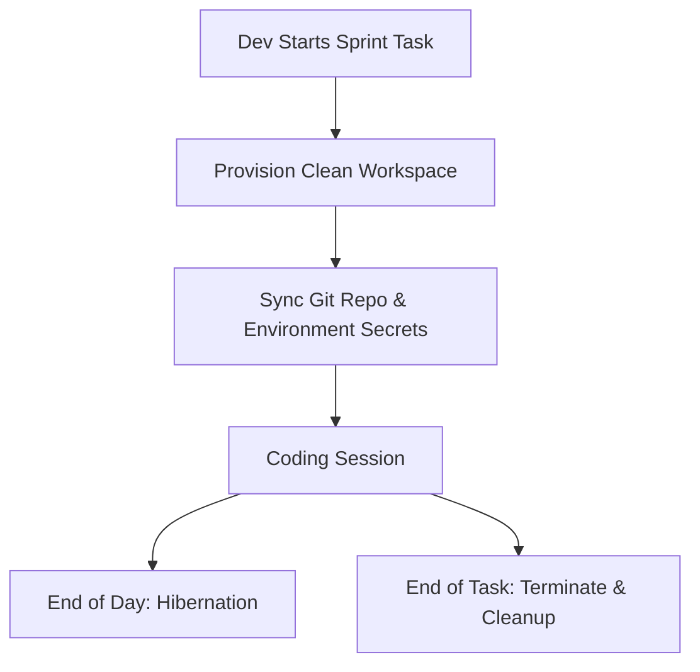

### 4. Golden Image Pipeline (Hacker-Ready)
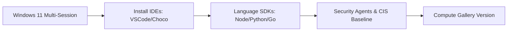

### 5. Toolchain Install Flow
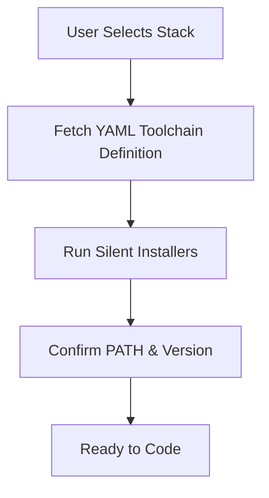

### 6. Security Trust Boundary
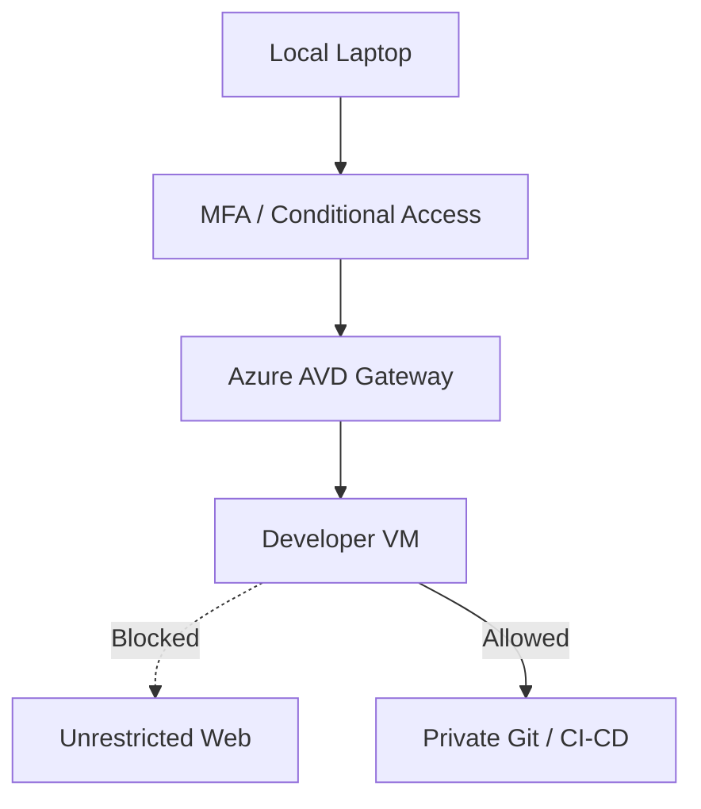

### 7. AVD Global Engineering Topology
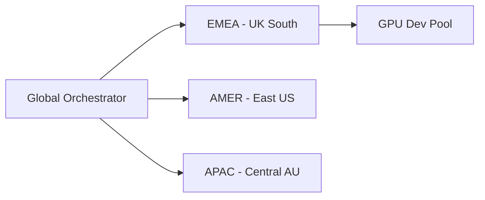

### 8. API Request Lifecycle
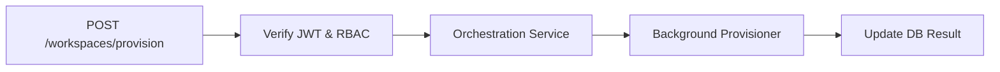

### 9. Multi-Tenant Engineering Model
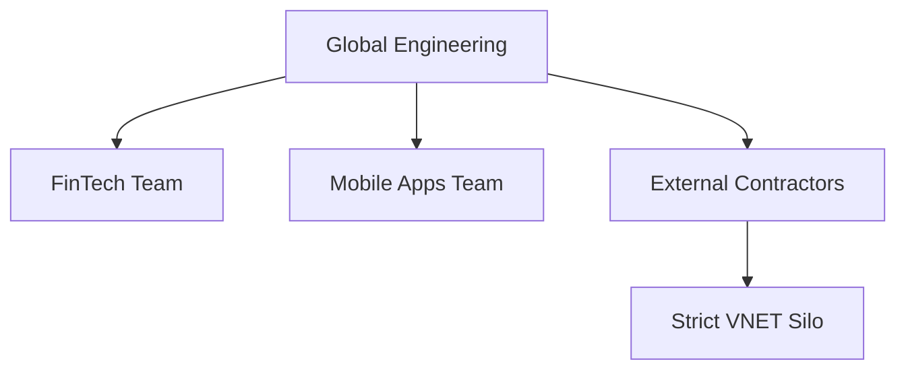

### 10. Monitoring & Telemetry Flow
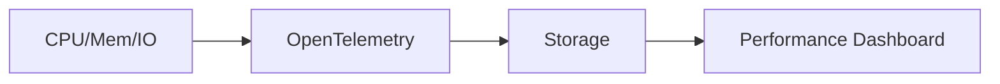

### 11. Disaster Recovery Topology
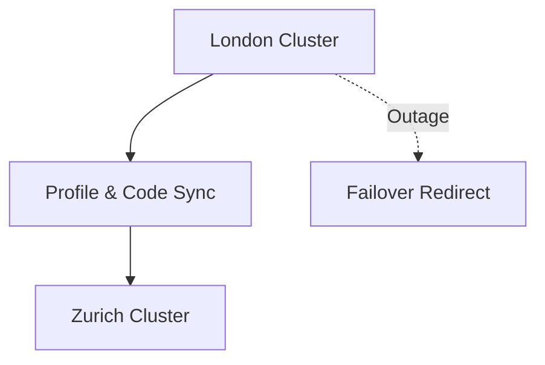

### 12. Contractor Isolated Access Flow
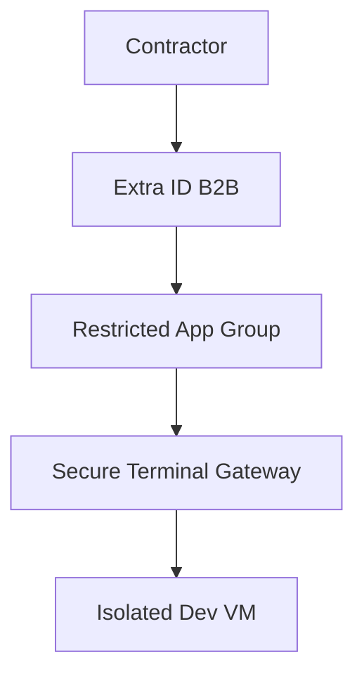

### 13. GPU Workstation Model (AI/ML)
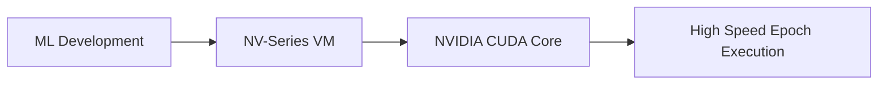

### 14. CI/CD Operations Pipeline
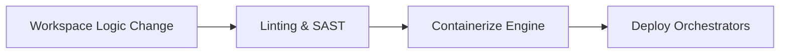

### 15. Executive Governance Workflow
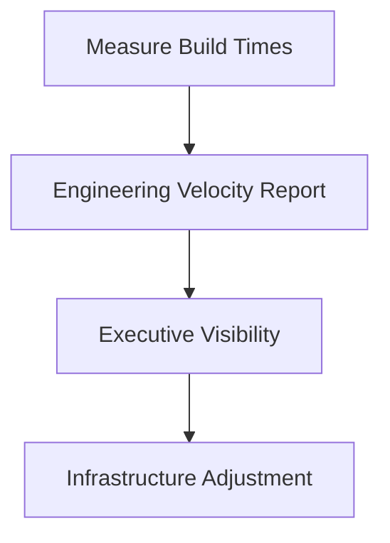

### 16. Developer Onboarding Flow
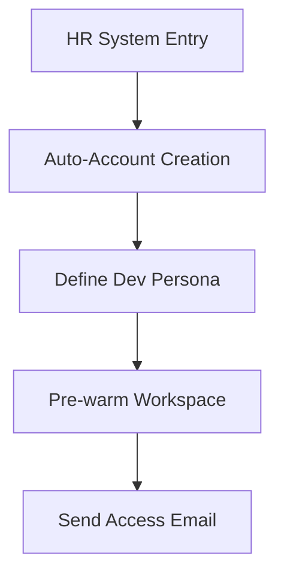

### 17. Identity Federation Model
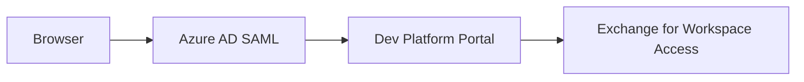

### 18. Repo Access Workflow
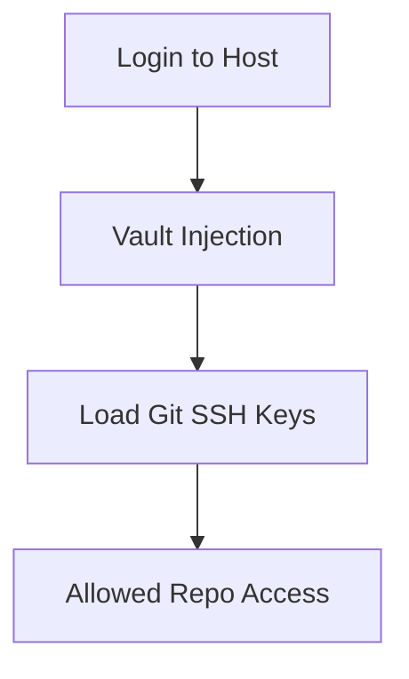

### 19. Global Region Topology
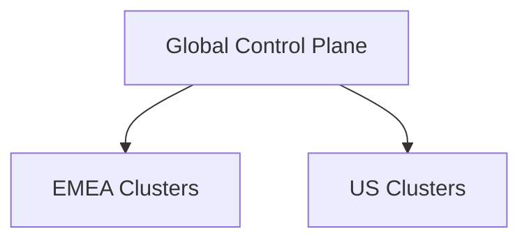

### 20. Productivity Analytics Flow
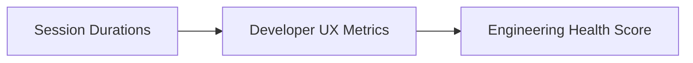

---

## 🚀 Experience The Platform

### Terraform Provisioning
```bash
cd terraform/environments/prd
terraform init
terraform apply -auto-approve
```

---
<sub>&copy; 2026 Devopstrio &mdash; Engineering the Future of Secure Distributed Engineering.</sub>
